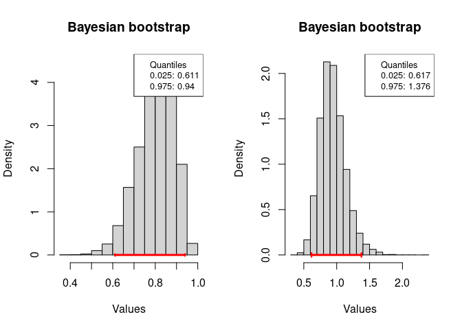

README
================
2023-12-25

This package provides a function to perform Bayesian bootstrap for a
given statistic on a given data set. The function is based on the
algorithm described by Rubin (1981),
<https://www.jstor.org/stable/2240875>.

Bayesian bootstrap uses Dirichlet distribution (or some other way) to
generate real valued weights summing up to $n$ – the length of the data
– for each observation in the data set for $b$ times. For each bootstrap
sample $j \in b$, the statistic of interest is calculated on the
weighted data.

## 1. Installation

Installation requires the “devtools” package to be installed.

    devtools::install_github("rajalah71/bayesboot")

Once installed, the package can be loaded using the following command.

``` r
library(bayesboot)
```

## 2. Examples

We can use this function to calculate the Bayesian bootstrap for any
statistic. For example, we can calculate the Bayesian bootstrap
posterior distribution for the mean and standard deviation of a given
data set.

Let’s try it on a small integer valued data set.

``` r
par(mfrow = c(1,2))
# Integer data means
data = c(1,2,2,4,9)
boot_means = bayesboot(data, mean, b = 10000, plot = TRUE)
# Standard deviation for the same data
boot_sd = bayesboot(data, sd, b = 10000, plot = TRUE)
```

<!-- -->

Let us next try it on a binary data set.

``` r
par(mfrow = c(1,2))
# Binary data means
data = c(0,1,1,0,1,1,1,0,1,1,1,1,1,1,1,1,1,1,0,1)
boot_means = bayesboot(data, f = mean, b = 10000, plot = TRUE)
#Binary data standard deviations
boot_sd = bayesboot(data, f = sd, b = 10000, plot = TRUE)
```

<!-- -->
